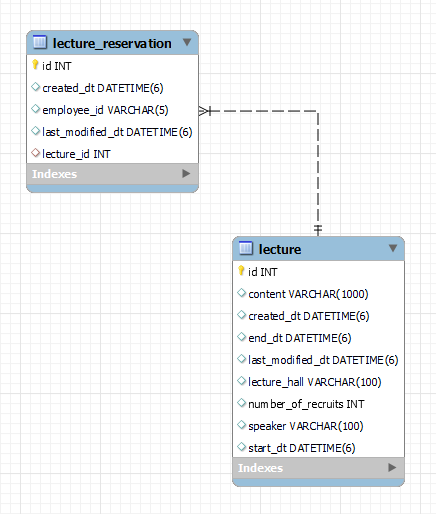

# 강연 예약시스템
사내 강연 예약시스템의 Restful API서버를 구현하였습니다.
- 개발언어: Java 11
- 프레임워크: Spring Boot 2.7.9
- RDBMS : Mysql 8
- 데이타 설계
  - 
- 그 밖에 고민했거나 설명하고 싶은 부분
  - 고정되있지는 않다.
- 해야될일
  - validation check
  - @CreatedDate null
  - @ColumnPosition
  - api 버전관리